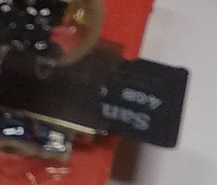
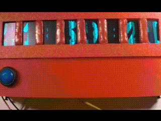
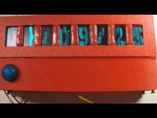
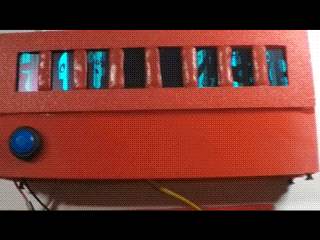
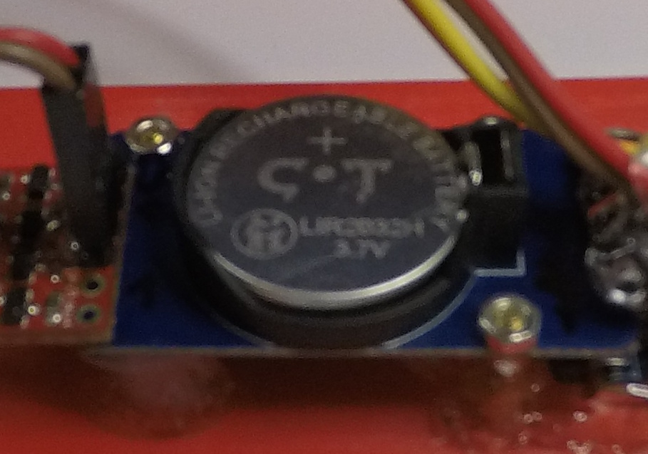

# 24129 - ANIMATED OLED CLOCK USING MICROPYTHON
---
## Description
 This project is implemented on Pi Pico W board using Micropython programming language and is a digital clock/thermometer with the following features:  
 1 - Single button update of clock using WiFi  
 2 - Auto display of time, date and temperature (in Fahrenheit and degrees Celcius) without user intervention  
 3 - Display on/off for night/day time operation
 4 - Provisioning WiFi network credentials using a micro SD Card.
 
## Operation

### Updating your WiFi credentials.
Before operating the clock, you need to FAT32 format a micro SD Card and create a text file called **"wifi_credentials.txt"** on it with the following two entries on each line:

*ssid: "enter your WIFI SSID here without the double quotes"  
password: "enter your WIFI password here without the double quotes"*

Then insert the micro SD Card into the adapter and power up the clock. After the digits on the displays are shown, the WiFi credentials will be valid until the next power cycle. This means you can remove the micro SD Card from the clock to keep it in a safe place. Following is how my micro SD Card looks when plugged in to the adapter.

Please note prior to each power cycle, be sure to insert a micro SD Card with the valid credentials to be able to connect to WiFi networks for updating time and date on the clock. Also, **without the micro SD Card, the clock will not start working.**

### Operating the clock
C:\Cagri_Workspace\software_projects\circuitapps\24129_micropython\

### A note on maintenance

This clock does not need much maintenance except the CR2032 coincell battery that the real time clock module uses to operate. I prefer rechargeable 2032 since it gets automatically recharged when the clock is powered using a USB cable. Following is how my RTC looks with the rechargeable CR2032 coincell battery plugged in.

This code has been developed and tested on Arduino Nano Every. (It will also work on Arduino Nano without any changes)

You simply need to connect pin 3 of your Arduino Nano to the 5V pulse output of a photoplethysmographic sensor to count the period between successive falling edges of the incoming signal. I build the sensor in **[this link][1]** and it works beautifully with the software here.

You may also use an alternative sensor, which outputs 5V pulses, and that should also work without any issues.

I will share my heart rate sensor buld videos on my YouTube and TikTok channels soon. So keep an eye on this space for further updates if you are planning to build your own heart rate sensor! My step by step instructions will make life easy for you.

The code takes care of all the visualization aspects on a 0.96 inch OLED display. I used HiLetGo's SSD1306 display for development and testing. You can find the **[OLED display here][3]**. You can connect that OLED display over I2C to your Arduino Nano board and it will work as intended using the code below.

You also need to install the Adafruit SSD1306 library and its dependencies into your Arduino IDE for using the OLED display above. This is a very easy process and you can find the step by step instructions (check Step 5) in **[this excellent guide][4]**.

The code handles the following cases:

1 . Display message there is no pulse detected.

2 . Display message while the pulse is bein gmeasured.

3 . Display the detected pulse and update it in real time.

I also experimented with a few bitmap display features in this code. When the board is powered up, you will see a familiar circuitapps themed splash screen that will be visible for 2 seconds before the heart rate measurements start. I also created a simple animation that will be played back when heart rate acquisition has been completed sucessfully. Feel free to change those bitmap images and animations to your liking. If you are intending to play
with bitmap images in this code, I strongly suggest checking out the link I provided in ***"Useful Tips #2"***.

I hope you will find this project compelling and engaging. Enjoy!

## Useful Tips
 
1. For accessing more OLED drawing and animation library functions, in your Arduino IDE go to Examples > Adafruit SSD1306 > ssd1306_128x64_i2c.
***This assumes the required Adafruit SSD1306 library and its dependencies are already installed in your Arduino development environment!***
2. Check out **[this free online tool][5]** for easily creating your own bitmap code for a copy & paste use in this program!
3. I also found a few useful tutorials on OLED display control using Arduino. Check out **[Ref 1][9]** and **[Ref 2][10]** for more information on this topic.

*GOOD LUCK & ENJOY EXPERIMENTING WITH OUR HEART RATE MONITOR!*

---
*Follow our channel on **[YouTube][6]**, **[TikTok][7]** and **[Instagram][8]** for hundreds of engaging build video tutorials:*

---

***circuitapps* - October 2024**

[1]: https://embedded-lab.com/blog/introducing-easy-pulse-a-diy-photoplethysmographic-sensor-for-measuring-heart-rate
[2]: ./microSDcard_in_adapter.jpg
[3]: https://www.amazon.com/dp/B06XRBYJR8
[4]: https://www.instructables.com/OLED-I2C-DISPLAY-WITH-ARDUINO-Tutorial/
[5]: https://javl.github.io/image2cpp/
[6]: https://www.youtube.com/@circuitapps
[7]: https://www.tiktok.com/@circuitappschannel
[8]: https://www.instagram.com/youtubecircuitapps
[9]: https://www.instructables.com/How-to-Display-Images-on-OLED-Using-Arduino/
[10]: https://www.instructables.com/Arduino-and-the-SSD1306-OLED-I2C-128x64-Display/

